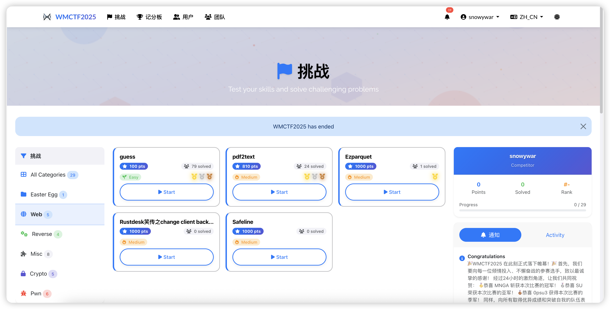
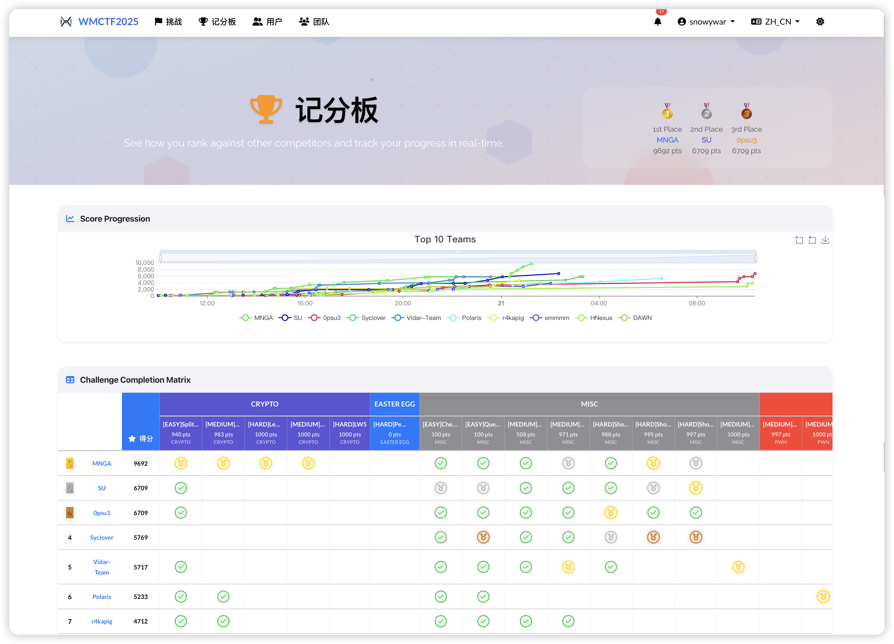
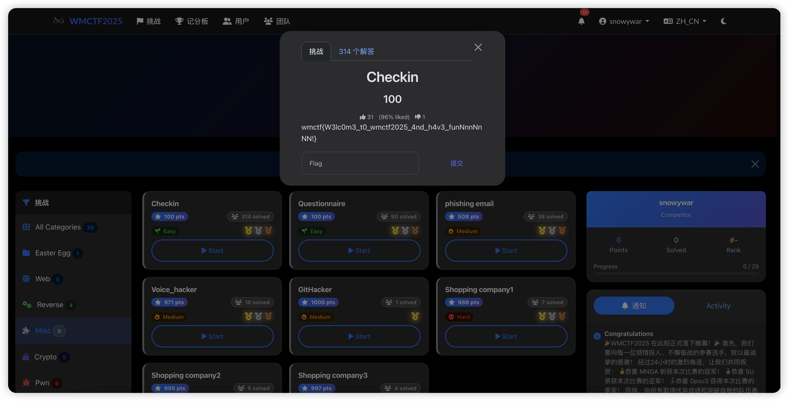

# WMCTF Modern Theme

A beautifully designed, modern CTFd theme inspired by Apple Design principles and tailored for the WMCTF competition. This theme features a contemporary flat design with smooth animations, excellent user experience, and full responsive support.

> 🏆 **Production Verified**: This theme has been successfully deployed and tested in **WMCTF 2025** competition at [wmctf.wm-team.cn](https://wmctf.wm-team.cn/), serving hundreds of participants with excellent performance and user experience.

## 📸 Screenshots & Demo

### Live Demo
🌐 **Experience it live**: [WMCTF 2025 Platform](https://wmctf.wm-team.cn/)

### Theme Showcase

#### Challenge Page
<!-- Add your challenge page screenshot here -->

*Beautiful challenge cards with difficulty indicators and smooth animations*

#### Scoreboard
<!-- Add your scoreboard screenshot here -->

*Engaging leaderboard with ranking badges and progress visualization*


#### Dark Mode Support
<!-- Add your dark mode screenshot here -->

*Full dark mode support with automatic theme switching*

## 🎨 Design Features

### Modern Apple-Inspired Design
- **Clean & Minimal**: Flat design with subtle shadows and gradients
- **Typography**: SF Pro Display and Inter fonts for optimal readability
- **Color Palette**: Professional blue (#007AFF), purple (#5856D6), and accent colors
- **Spacing**: Consistent Apple-style spacing and proportions

### Visual Enhancements
- **Glass Morphism**: Backdrop blur effects for modern aesthetics
- **Smooth Animations**: Slide-up, fade-in, and hover effects
- **Interactive Elements**: Hover states with subtle transformations
- **Custom Icons**: Font Awesome icons with brand consistency

### User Experience
- **Intuitive Navigation**: Modern dropdown menus and clean layout
- **Challenge Cards**: Beautiful card-based challenge display with difficulty indicators
- **Scoreboard**: Engaging leaderboard with rank badges and progress bars
- **Login Experience**: Centered, card-based login with gradient headers

## 🚀 Key Improvements

### Navigation Bar
- Glass morphism effect with backdrop blur
- Streamlined user menu with dropdown
- Modern language selector
- Improved mobile responsiveness

### Challenge Page
- **Hero Section**: Engaging introduction with animated elements
- **Card Layout**: Modern challenge cards with:
  - Difficulty indicators (Easy/Medium/Hard)
  - Point badges with gradients
  - Solved state indicators
  - Hover animations and effects
- **Category Headers**: Clean organization with statistics

### Scoreboard
- **Ranking Display**: Medal icons for top 3 positions
- **Progress Visualization**: Progress bars and score displays
- **Interactive Filters**: Modern pill-style category filters
- **Empty State**: Encouraging messaging for new competitions

### Login Page
- **Centered Design**: Card-based layout with gradient header
- **Brand Integration**: WMCTF logo and branding
- **Form Enhancement**: Rounded inputs with focus effects
- **Feature Highlights**: Security, speed, and competition icons

## 🛠 Technical Stack

### Frontend Technologies
- **Bootstrap 5.3.3**: Modern CSS framework
- **Tailwind CSS 3.4.1**: Utility-first CSS framework
- **Alpine.js 3.13.5**: Lightweight JavaScript framework
- **Vite 5.0.12**: Modern build tool
- **SASS 1.70.0**: CSS preprocessor

### Fonts & Icons
- **SF Pro Display**: Apple's system font
- **Inter**: Modern geometric sans-serif
- **Font Awesome 6.5.1**: Comprehensive icon library

### Build Process
- **PostCSS**: CSS processing with autoprefixer
- **Vite**: Fast development and optimized production builds
- **Asset Pipeline**: Automatic font and image copying

## 📱 Responsive Design

### Breakpoints
- **Mobile First**: Optimized for mobile devices
- **Tablet**: Enhanced layout for medium screens
- **Desktop**: Full-featured experience for large screens

### Mobile Optimizations
- Touch-friendly buttons and navigation
- Optimized card layouts
- Collapsible navigation menu
- Reduced animation complexity

## 🎯 Brand Identity

### WMCTF Branding
- **Logo**: Custom SVG logo with circuit pattern
- **Colors**: Brand-consistent color scheme
- **Typography**: Professional and readable font choices
- **Imagery**: Custom hero backgrounds and graphics

### Visual Hierarchy
- Clear content organization
- Consistent spacing and alignment
- Proper contrast ratios
- Accessible color combinations

## 🔧 Installation & Development

### Prerequisites
- Node.js 16+ and Yarn package manager
- CTFd instance for testing

### Development Setup
1. **Install Dependencies**:
   ```bash
   yarn install
   ```

2. **Development Mode**:
   ```bash
   yarn dev
   ```
   This runs Vite in watch mode for live reloading.

3. **Production Build**:
   ```bash
   yarn build
   ```
   Generates optimized assets in the `static` folder.

### File Structure
```
assets/
├── img/              # Images and SVG assets
├── js/               # JavaScript modules
├── scss/             # SASS stylesheets
│   ├── main.scss     # Main stylesheet
│   └── includes/     # Component styles
templates/            # Jinja2 templates
├── base.html         # Base template
├── challenges.html   # Challenge listing
├── login.html        # Login page
├── scoreboard.html   # Scoreboard
└── components/       # Reusable components
static/               # Compiled assets (generated)
```

#### How to use?

```
git clone https://github.com/wm-team/ctfd-wmctf2025-theme.git CTFd/themes/wmctf2025
```

## 🎨 Customization

### Color Scheme
The theme uses CSS custom properties for easy customization:
```css
:root {
  --wmctf-primary: #007AFF;    /* Apple Blue */
  --wmctf-secondary: #5856D6;  /* Apple Purple */
  --wmctf-accent: #FF3B30;     /* Apple Red */
  --wmctf-success: #34C759;    /* Apple Green */
  --wmctf-warning: #FF9500;    /* Apple Orange */
}
```

### Dark Mode
Full dark mode support with automatic theme switching:
- Dark color variables
- Adjusted contrast ratios
- Consistent component styling

## 🚀 Performance Features

### Optimization
- **Lazy Loading**: Progressive content loading
- **Asset Optimization**: Minified CSS and JavaScript
- **Font Loading**: Optimized web font delivery
- **Image Optimization**: SVG graphics for scalability

### Browser Support
- Modern browsers (Chrome, Firefox, Safari, Edge)
- Progressive enhancement for older browsers
- CSS Grid and Flexbox layouts
- CSS Custom Properties

## 📄 License

This project is licensed under the Apache License 2.0. See the [LICENSE](LICENSE) file for details.

The custom WMCTF branding and enhancements are designed specifically for the WMCTF competition.

## 🎉 Production Success

**WMCTF 2025 Achievement**: This theme has been successfully deployed and battle-tested in the real-world WMCTF 2025 competition:

- 🌐 **Live Platform**: [wmctf.wm-team.cn](https://wmctf.wm-team.cn/)
- 👥 **Participants**: Successfully served hundreds of CTF participants
- ⚡ **Performance**: Excellent loading speeds and responsive design
- 🔧 **Stability**: Zero major issues during the competition period
- 📱 **Cross-platform**: Perfect compatibility across all devices and browsers
- 🎯 **User Experience**: Received positive feedback from participants for its modern design and intuitive interface

The theme has proven its reliability, performance, and user-friendliness in a high-stakes competition environment, making it a trusted choice for CTF platforms.

---

**Created with ❤️ for WMCTF** - A modern, beautiful, and user-friendly CTF platform experience that has been proven in production.
# UMCS-themes

